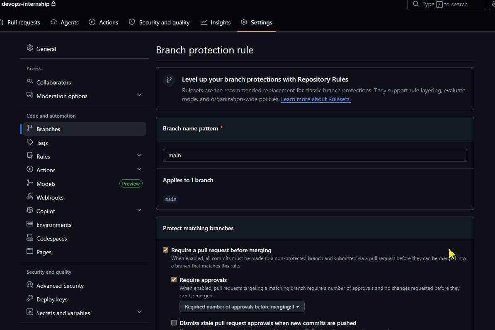

# DevOps Internship

## Answers

### Чому змінюються inode, але не диск?

Порожні файли займають inode (метадані), але майже не використовують дисковий простір.

### Як знайти директорію з найбільшою кількістю файлів?

```sh
find / -type f | sed 's|/[^/]*$||' | sort | uniq -c | sort -nr | head
```

### Що означає t у drwxrwxrwt?

Це sticky bit — дозволяє видаляти файли тільки власнику файлу або root.

### Де використовується за замовчуванням?

У директорії: `/tmp`

### Що буде, якщо інший користувач спробує видалити файл?

Він отримає відмову, навіть якщо має права на запис у директорію.

### Навіщо sticky bit?

Щоб захистити файли користувачів у спільних директоріях.

## Protected Branches



## RAM and Disk monitor services

### 1. Disk Monitor

- create script
  `nano /usr/local/bin/disk_monitor.sh`

- paste script content and save

- make executable
  `chmod +x /usr/local/bin/disk_monitor.sh`

- create service
  `nano /etc/systemd/system/disk-monitor.service`

- create timer
  `nano /etc/systemd/system/disk-monitor.timer`

---

### 2. RAM Monitor

- create script
  `nano /usr/local/bin/ram_monitor.sh`

- paste script content and save

- make executable
  `chmod +x /usr/local/bin/ram_monitor.sh`

- create service
  `nano /etc/systemd/system/ram-monitor.service`

- create timer
  `nano /etc/systemd/system/ram-monitor.timer`

---

### 3. Log Watcher

- create script
  `nano /usr/local/bin/log_watcher.sh`

- paste script content and save

- make executable
  `chmod +x /usr/local/bin/log_watcher.sh`

- create service
  `nano /etc/systemd/system/log-watcher.service`

---

### 4. Reload systemd

- reload systemd configuration
  `sudo systemctl daemon-reload`

---

### 5. Enable and start timers

- enable disk monitor timer
  `sudo systemctl enable --now disk-monitor.timer`

- enable RAM monitor timer
  `sudo systemctl enable --now ram-monitor.timer`

---

### 6. Enable log watcher

- start service
  `sudo systemctl enable --now log-watcher.service`

---

### 7. Verification

- check timers
  `systemctl list-timers`

- check disk monitor
  `systemctl status disk-monitor.timer`

- check RAM monitor
  `systemctl status ram-monitor.timer`

- check logs
  `cat /var/log/disk_monitor.log`
  `cat /var/log/ram_monitor.log`
  `cat /var/log/email_notifications.log`

---

## 8. Optional (manual test)

- run disk monitor manually
  `/usr/local/bin/disk_monitor.sh`

- run RAM monitor manually
  `/usr/local/bin/ram_monitor.sh`
